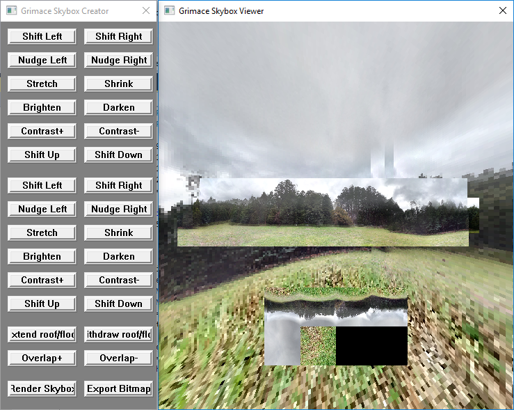

# Skybox Creator
Tool for creating skybox textures that could be used in a 3D video game.

Developed for Windows, using C++ and OpenGL 3.1.

The above image shows the application running, where the rendered skybox texture is applied to the cube surrounding the camera, and also the component images are shown.

## About
The program uses the Windows API and OpenGL in C++ to make a tool which could be helpful for graphical elements of a video game. It merges three panoramic images, a roof image and a floor image (all in bitmap form), into a single image file that could be used as a texture file to apply to a skybox, which is a cube positioned on the outside of a virtual 3D world to give the impression of environmental surroundings in the distance.

The user can control how all of the images are merged, so that they can be re-positioned and have their colours adjusted to make them blend properly. The resulting rendered texture can be saved as an uncompressed bitmap image.

## Installation Instructions
You will require Visual Studio installed on your computer, including the component for desktop Windows C++ development.
* Clone this repository
* Download 'glext.h' from [The Khronos Group Inc](https://www.khronos.org/registry/OpenGL/api/GL/glext.h) and place it in the 'src' directory
* Open the Visual Studio Solution file in the root directory
* Build the solution to create the .exe file
* Ensure that the application has access to five images with specific names, all located in a directory named 'img' which must be in the same location as the .exe (sample images are supplied)
  * The panoramic images must be named 'pano_bottom.bmp', 'pano_middle.bmp', and 'pano_top.bmp'
  * The roughly-square roof and floor images must be named 'tex_ground.bmp' and 'tex_roof.bmp'
